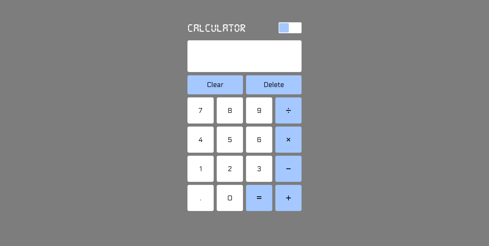
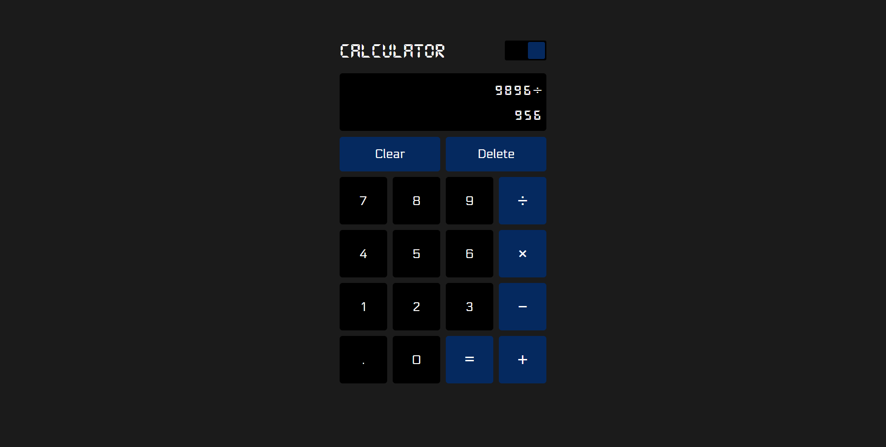
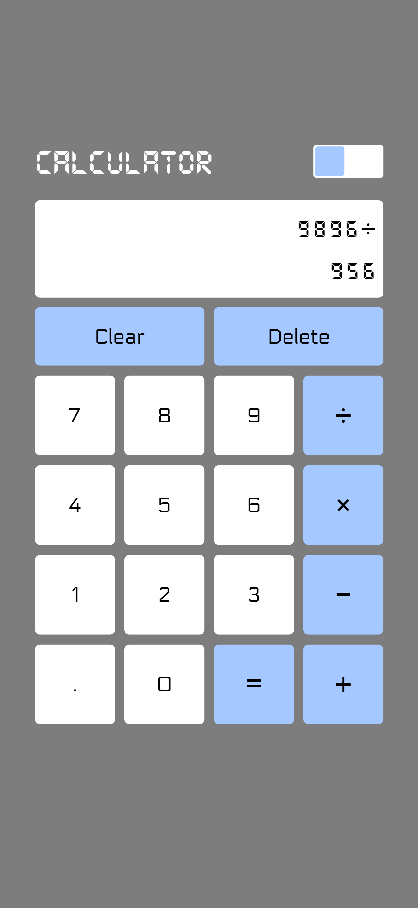
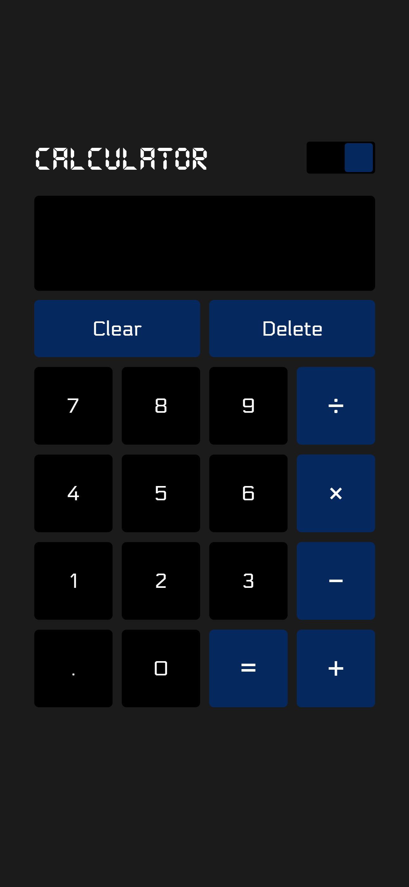

# Simple Calculator
This is just a simple calculator where you can calculate things in advance and make things workout 😜

- You can Add Numbers
- Subtract Numbers
- Multiply Numbers
- Divide Numbers
- Float Values are also possible
- Clear Button - To Clear everything in the Display
- Delete Button - To Delete a Single Last Number to fix if you type wrong
- Dark Mode Button - To please your eyes

Test it out !

## About the Project
This is a project I created to complete **[The Odin Project](https://www.theodinproject.com/lessons/foundations-calculator)** assignment.

The page is fully responsive on both 
Desktop & Mobile * but Keyboard Keys are not yet supported, to type a number, you can only use your cursor and click for now.

This is my own solution. I wrote every line of codes on my own.

## Screenshots
Desktop Light

Desktop Dark (with Numbers typed)

Mobile Light (with Numbers typed)

Mobile Dark

## Links
Live Site Url - [Calculator](https://0xkev21.github.io/calculator/)

## Built with
- HTML
- Vanilla CSS
- Vanilla Javascript

I didn't use any framework or library proving I have full understanding of the fundamentals

## What I learned
Things I have learnt from this project
- How to handle DOM and Events with Javascript
- How to use CSS variables to build Design Modes
- How to collect user's input and conditionally response them and show results on a page

## About Me
I am a student trying to be a self-taught developer.
- My profile - [Github](https://github.com/0xkev21/)

---